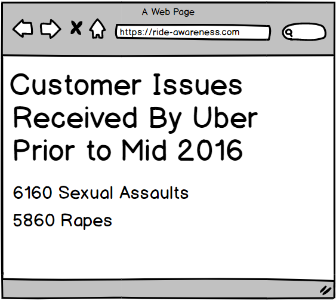

# Final Project

## Part 1

## Basic Outline

It was spring semester that I had received an interview call from a company regarding a product manager role. I was supposed to quantify the ride quality metrics for anyone using a ride to go from one point to another, be it uber, ola etc using data visualization. At that point of time, I was not able to put in the required amount of time to bring out the relevant insights. And moreover, I didn't have access to many data visualization tools and design ideology I have learnt from this class.

So, I want to use this project as a medium to strengthen my portfolio for being a product manager and work on the following problem :
Being the product manager of a ride offering company, I want to quantify the ride metrics that is agreed upon by the business development team, the engineering team, the design team and the stakeholders involved in the company. Moreover, these should be the metrics which should be the primary focus to achieve the best ride quality for the end user. The end goal is to present to the audience using data visualization tools and be able to convince them completely of the metrics upon which the products of a ride offering company should be built.

## Initial Sketch
There are basically two sketches :
1. It shows the journey of an actual user taking a ride.
[Sketch 1](/image1.jpg)
2. The audience (the class) and their journey to convince them that the ride quality metrics are good enough to make sure a user has a great ride experience 
[Sketch 2](/image2.jpg)

## The data 

The primary necessity to achieve the end goal of convincing the user of what is most important in a ride quality is based on accurate data compiled by user and market research. There are two major sources of data. 

1. There will be a user survey form to determine the most important aspects of ride quality for different users. Here is the [link](https://docs.google.com/forms/d/1B0XvTB41wukkjGXR_tR5dAw271pagvj3HZg4cthGWRk/edit).
2. Finding any relevant research conducted on the market and the users conducted prior in this regard. (Will add on the go if nay resources used)

## Method and medium

I plan to use the shorthand application and the other data visualization tools learnt in the class to build a user story that resonates with all the users. The end goal is to show a user story backed by data that taking into account the metrics of a ride quality leads to a user having a great experience from the ride taken.

So, to walk through the entire method, these are the 2 major steps :
Accumulate as much data to quantify the ride quality to as minimum metrics as possible making sure every aspect is covered.
Build visualizations to signify how important these metrics are and how they cover the ride quality aspect.
And finally present using a story of a person wanting to take a ride, and if the user takes the ride the ride covers all the ride quality metrics, the end user is bound to have a great and a happy experience.

## Part 2

After going through lots of discussion and thinking, and to make sure to concentrate on a particular cause and not deviate a lot so that the user understands the story related to taking a ride. It was decided to pursue the following story or steps in order to make aware of a common person of the the incidents created due to bad quality of rides by uber and lyft. 

1. Present the current situation detailing how big the current business of uber and ride is!
2. Understanding via a survey amongst the regular cab riders, the most important concerns related to cab rides.
3. List out the topmost complaints faced by uber and lyft.
4. List out the assaults and the different type of incidents that have happened at uber and lyft over the previous years.
5. The third and fourth point above narrows it down that the main problem faced is that the uber and lyft don't do a comprehensive background check while hiring a driver and anyone can easily become one. This results to different type of assaults where cab riders aren't safe. Thus, it narrows down to signing a petition for uber and lyft to be more cautious while hiring a driver.

The basic wireframe story built via [Balsamiq] (https://balsamiq.cloud) is shown below :

I have used just one huge number in order to portray how important lift and uber have become a part of day to day commute. 

This highlights findings of the user survey that was conducted on 42 people from 20-30 years of age who were regular cab rider. It finds that safety is the most important concern for everyone riding an uber or a lyft. The pie chart graph shown above will represent that out of the 42 people for whom the survey was conducted, 25 of them felt the safety was the most important concern. Others listed price, comfort etc. as their major concern.

This represents the top 5 complaints of the riders, again drivers being rude and safety being the major concern. Its a bar chart representation of the number of complaints. This dataset was available online.

This again represents a bar graph with numbers representing the different assaults (with 395 alleged sexual assaults reported being the topmost) and serious incidents occurred due to bad drivers.This is majorly data after 2016. Source : https://www.whosdrivingyou.org/rideshare-incidents 

Another page over here will be displayed showing uber leaked data containing two numbers, 6160 sexual assault tickets and 5827 rape tickets received by Uber with the source being the article : https://www.buzzfeednews.com/article/charliewarzel/internal-data-offers-glimpse-at-uber-sex-assault-complaints#.wxZnDylOR

This is the final call to action for everyone to join a movement to make sure uber, lyft and other companies do a comprehensive background check before they hire someone as a driver. 

Interview Questions and findings : 

Interview was conducted whether to find out the above shorthand story is compelling enough and if it made sense to the audience. It was majorly focused on the users from 20-30 using cabs regularly.

The major questions were as follows : 

1. Did you know the information that was presented to you above?
2. Were you able to understand the flow and the data presented? Would you like to change/add/remove anything?
3. Will you be willing to sign the petition? If not, why?
 

 
